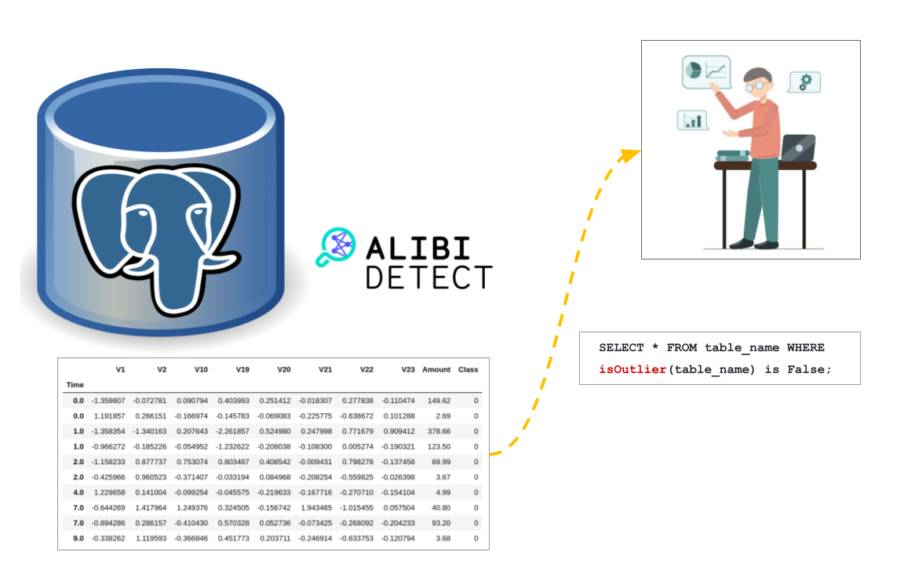

# pgAmber :large_orange_diamond:

## Data Observability for PostgreSQL using Alibi-Detect

Monitoring the data quality can be crucial for many real-world forcasting applications. We are seeing an unprecedented number of downstream apps or ML models being built using data extracted from SQL-based data warehouses and feature stores. A good set of observability tools at the data extraction layer could have a significant positive impact on optimizing such pipelines and processes.

[Alibi Detect](https://docs.seldon.io/projects/alibi-detect/en/stable/index.html) is an open source Python library focused on outlier, adversarial and drift detection. Such machine learning based detection functions when paired with clever SQL queries can help users foresee any downstream data quality related issues.

This repository plans to hosts a set of stored functions for data observability on the [PostgreSQL](https://www.postgresql.org/) database. These procedures are written in [python procedural language](https://www.postgresql.org/docs/current/plpython.html) to observe data abnormalities using alibi-detect python package. The current version is limited to detecting outlier records in numerical data tables.

### Outlier Detection

- VAE Outlier Detection - [Quickstart](./procs/outlier-detection/vae/README.md)

#### Aside

The project name **pgAmber**, pronounced as 'paigamber' is a synonym for clairvoyant (or prophet) in conjunction with the aim of enabling the users to foresee data quality related issues.
